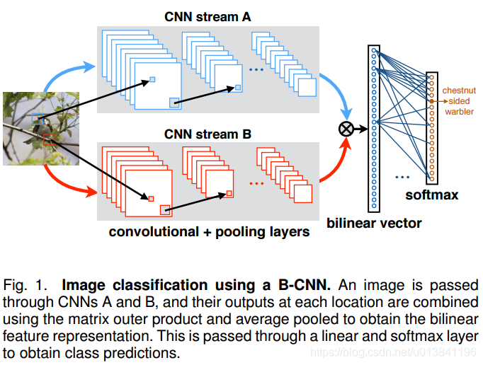
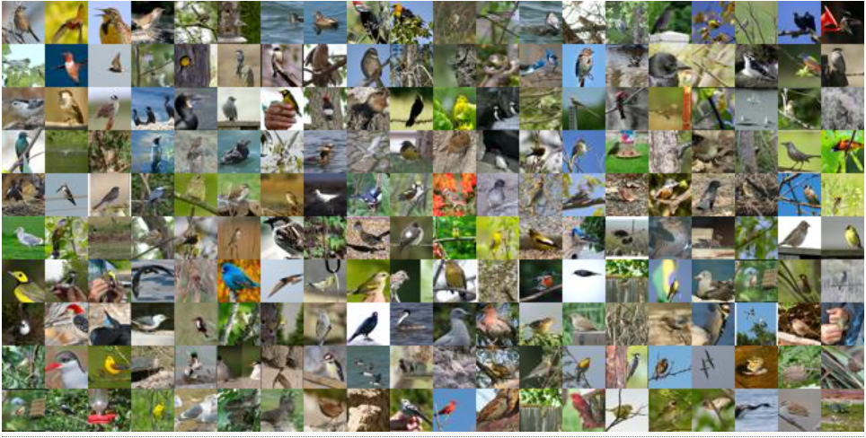

# BiLinear_CNN

### 项目功能
该项目利用MindSpore实现细粒度分类网络双线性网络Bilinear CNN，对200种鸟类进行图象分类。

### 模型结构
模型结构图如下：

该网络主要是使用VGG16预训练模型来提取特征，然后将提取到的特征做矩阵乘法（即transpose后，自己乘自己），最后接一个全连接层，做200分类。
详情见论文《Bilinear CNNs for Fine-grained Visual
Recognition》：
https://arxiv.org/pdf/1504.07889.pdf
### 环境依赖
详情见requirements.txt

### 数据集介绍
数据集名字为：Cub200-2011，其中包含200类鸟的图片。

数据集CUB-200下载地址：http://www.vision.caltech.edu/visipedia/CUB-200-2011.html

### 训练

python trainer.py

通过config.py的train_all设置是只微调全连接层，还是训练全部网络参数。

### 测试

边训练边进行测试